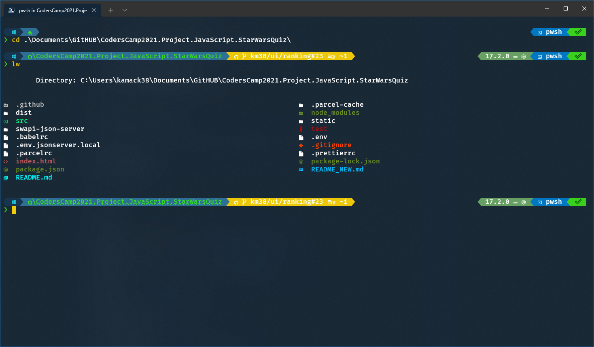
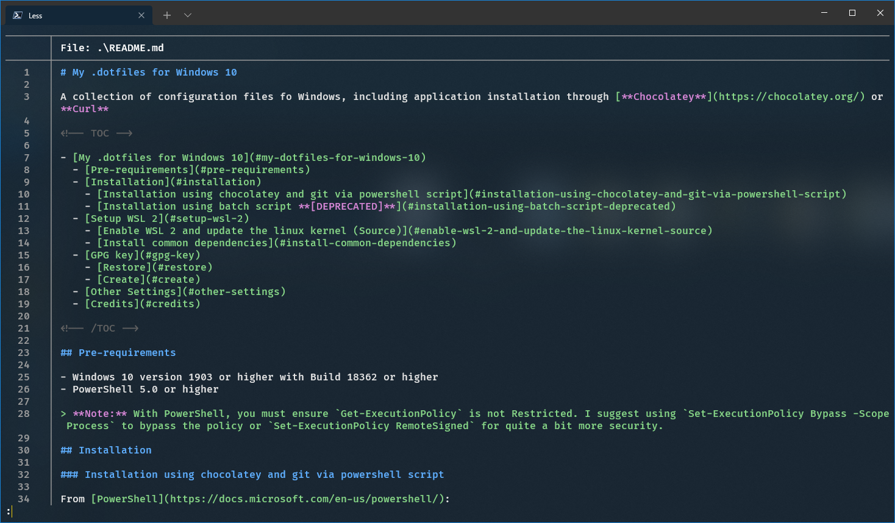
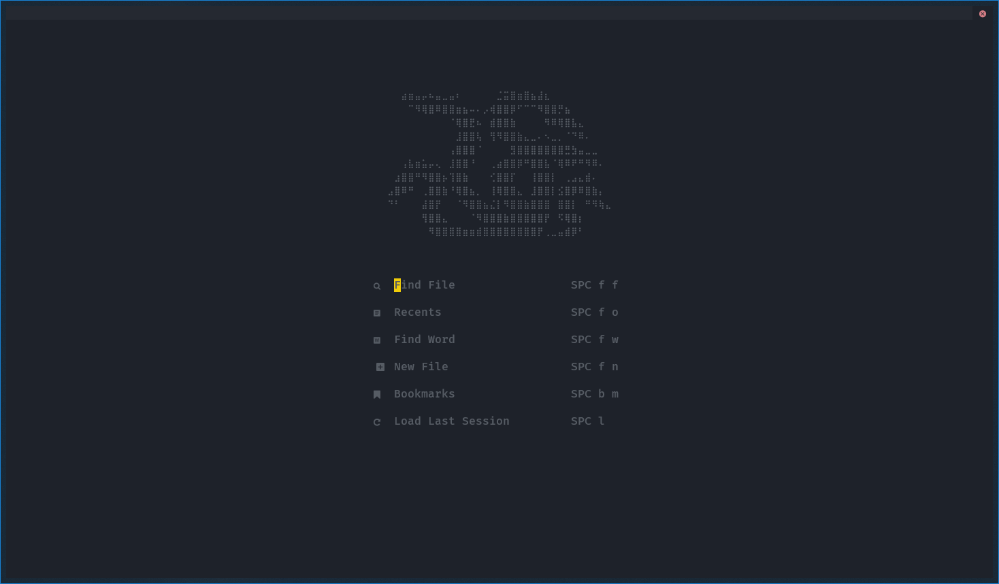
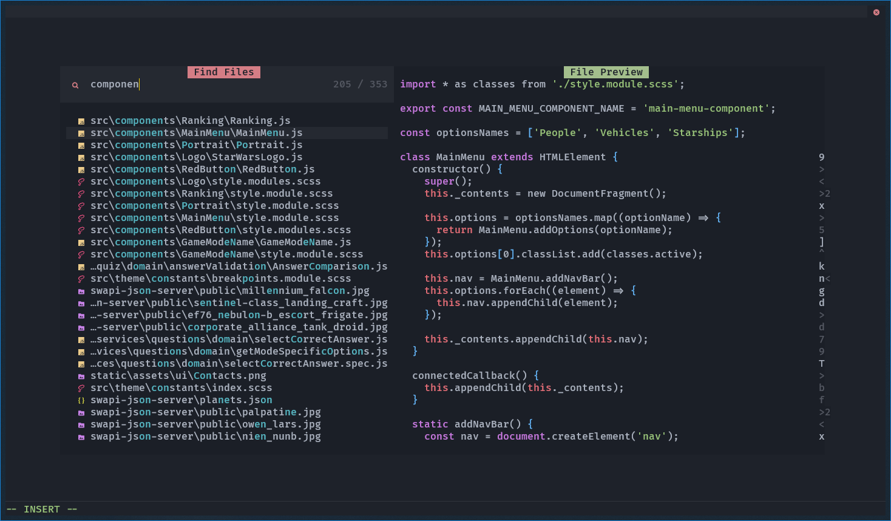
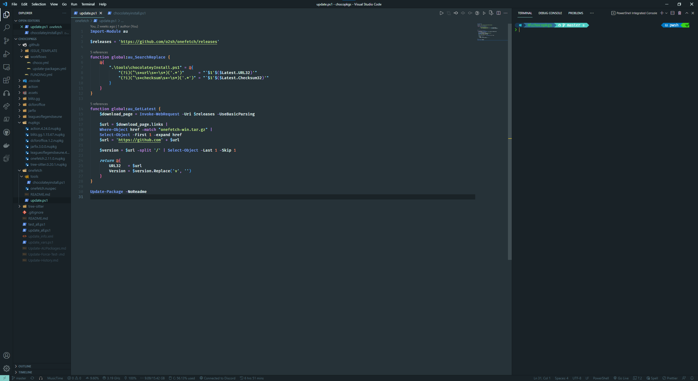

<h1 align="center">My .dotfiles for Windows 10</h1>

<div align="center">

A collection of configuration files for Windows, including application
installation through [**Chocolatey**](https://chocolatey.org/).

<div align="center">
      <a href="#installation">Install</a>
  <span> • </span>
       <a href="#showcase">Showcase</a>
  <span> • </span>
  <a href="#other-settings">Other Settings</a>
  <span> • </span>
        <a href="#credits">Credits</a>
  <p></p>
</div>

[](https://github.com/PowerShell/PowerShell)

</div>

## Installation

### Pre-requirements

- Windows 10 version 1903 or higher with Build 18362 or higher
- PowerShell 5.0 or higher

> [!NOTE]
> With PowerShell, you must ensure `Get-ExecutionPolicy` is not Restricted. I
> suggest using `Set-ExecutionPolicy Bypass -Scope Process` to bypass the policy
> or `Set-ExecutionPolicy RemoteSigned` for quite a bit more security.

### Installation using chocolatey and git via powershell script

From [PowerShell](https://docs.microsoft.com/en-us/powershell/):

> [!NOTE]
> You **DON'T** need [**Chocolatey**](https://chocolatey.org/) and
> [**Git**](https://git-scm.com/) installed, because the script will download
> them automatically, but make sure PowerShell is run as administrator.

```powershell
iex ((new-object net.webclient).DownloadString('https://raw.githubusercontent.com/kamack38/dotfiles/main/install/install.ps1'))
```

**OR** (Shorter version)

```powershell
Set-ExecutionPolicy RemoteSigned; iwr -useb https://git.io/J1CXE | iex
```

[Click here](https://github.com/kamack38/dotfiles/wiki/%5BDeprecated%5D-Installation-using-batch-script)
to check out deprecated installation methods.

## Showcase







## Other Settings

<details>
  <summary>
      VSCode Extensions
  </summary>
  <ul>
      <li><a href="https://marketplace.visualstudio.com/items?itemName=aaron-bond.better-comments">aaron-bond.better-comments</a></li>
      <li><a href="https://marketplace.visualstudio.com/items?itemName=akamud.vscode-caniuse">akamud.vscode-caniuse</a></li>
      <li><a href="https://marketplace.visualstudio.com/items?itemName=akamud.vscode-theme-onedark">akamud.vscode-theme-onedark</a></li>
      <li><a href="https://marketplace.visualstudio.com/items?itemName=alexcvzz.vscode-sqlite">alexcvzz.vscode-sqlite</a></li>
      <li><a href="https://marketplace.visualstudio.com/items?itemName=aster.vscode-subtitles">aster.vscode-subtitles</a></li>
      <li><a href="https://marketplace.visualstudio.com/items?itemName=austin.code-gnu-global">austin.code-gnu-global</a></li>
      <li><a href="https://marketplace.visualstudio.com/items?itemName=bagetx.inf">bagetx.inf</a></li>
      <li><a href="https://marketplace.visualstudio.com/items?itemName=bierner.emojisense">bierner.emojisense</a></li>
      <li><a href="https://marketplace.visualstudio.com/items?itemName=bierner.markdown-preview-github-styles">bierner.markdown-preview-github-styles</a></li>
      <li><a href="https://marketplace.visualstudio.com/items?itemName=christian-kohler.npm-intellisense">christian-kohler.npm-intellisense</a></li>
      <li><a href="https://marketplace.visualstudio.com/items?itemName=christian-kohler.path-intellisense">christian-kohler.path-intellisense</a></li>
      <li><a href="https://marketplace.visualstudio.com/items?itemName=chunsen.bracket-select">chunsen.bracket-select</a></li>
      <li><a href="https://marketplace.visualstudio.com/items?itemName=cschlosser.doxdocgen">cschlosser.doxdocgen</a></li>
      <li><a href="https://marketplace.visualstudio.com/items?itemName=DavidAnson.vscode-markdownlint">DavidAnson.vscode-markdownlint</a></li>
      <li><a href="https://marketplace.visualstudio.com/items?itemName=dbaeumer.vscode-eslint">dbaeumer.vscode-eslint</a></li>
      <li><a href="https://marketplace.visualstudio.com/items?itemName=dirt-lxiv.language-csgo-cfg">dirt-lxiv.language-csgo-cfg</a></li>
      <li><a href="https://marketplace.visualstudio.com/items?itemName=dkundel.vscode-npm-source">dkundel.vscode-npm-source</a></li>
      <li><a href="https://marketplace.visualstudio.com/items?itemName=DotJoshJohnson.xml">DotJoshJohnson.xml</a></li>
      <li><a href="https://marketplace.visualstudio.com/items?itemName=dsznajder.es7-react-js-snippets">dsznajder.es7-react-js-snippets</a></li>
      <li><a href="https://marketplace.visualstudio.com/items?itemName=eamodio.gitlens">eamodio.gitlens</a></li>
      <li><a href="https://marketplace.visualstudio.com/items?itemName=ecmel.vscode-html-css">ecmel.vscode-html-css</a></li>
      <li><a href="https://marketplace.visualstudio.com/items?itemName=eg2.vscode-npm-script">eg2.vscode-npm-script</a></li>
      <li><a href="https://marketplace.visualstudio.com/items?itemName=enkia.tokyo-night">enkia.tokyo-night</a></li>
      <li><a href="https://marketplace.visualstudio.com/items?itemName=Equinusocio.vsc-community-material-theme">Equinusocio.vsc-community-material-theme</a></li>
      <li><a href="https://marketplace.visualstudio.com/items?itemName=Equinusocio.vsc-material-theme">Equinusocio.vsc-material-theme</a></li>
      <li><a href="https://marketplace.visualstudio.com/items?itemName=esbenp.prettier-vscode">esbenp.prettier-vscode</a></li>
      <li><a href="https://marketplace.visualstudio.com/items?itemName=firefox-devtools.vscode-firefox-debug">firefox-devtools.vscode-firefox-debug</a></li>
      <li><a href="https://marketplace.visualstudio.com/items?itemName=formulahendry.code-runner">formulahendry.code-runner</a></li>
      <li><a href="https://marketplace.visualstudio.com/items?itemName=foxundermoon.shell-format">foxundermoon.shell-format</a></li>
      <li><a href="https://marketplace.visualstudio.com/items?itemName=GEEKiDoS.vdf">GEEKiDoS.vdf</a></li>
      <li><a href="https://marketplace.visualstudio.com/items?itemName=GitHub.vscode-pull-request-github">GitHub.vscode-pull-request-github</a></li>
      <li><a href="https://marketplace.visualstudio.com/items?itemName=GrapeCity.gc-excelviewer">GrapeCity.gc-excelviewer</a></li>
      <li><a href="https://marketplace.visualstudio.com/items?itemName=humao.rest-client">humao.rest-client</a></li>
      <li><a href="https://marketplace.visualstudio.com/items?itemName=Hyeon.c-math-viewer">Hyeon.c-math-viewer</a></li>
      <li><a href="https://marketplace.visualstudio.com/items?itemName=icrawl.discord-vscode">icrawl.discord-vscode</a></li>
      <li><a href="https://marketplace.visualstudio.com/items?itemName=ionutvmi.reg">ionutvmi.reg</a></li>
      <li><a href="https://marketplace.visualstudio.com/items?itemName=jeff-hykin.better-cpp-syntax">jeff-hykin.better-cpp-syntax</a></li>
      <li><a href="https://marketplace.visualstudio.com/items?itemName=liximomo.sftp">liximomo.sftp</a></li>
      <li><a href="https://marketplace.visualstudio.com/items?itemName=lukasz-wronski.ftp-sync">lukasz-wronski.ftp-sync</a></li>
      <li><a href="https://marketplace.visualstudio.com/items?itemName=mgmcdermott.vscode-language-babel">mgmcdermott.vscode-language-babel</a></li>
      <li><a href="https://marketplace.visualstudio.com/items?itemName=mikestead.dotenv">mikestead.dotenv</a></li>
      <li><a href="https://marketplace.visualstudio.com/items?itemName=mkaufman.HTMLHint">mkaufman.HTMLHint</a></li>
      <li><a href="https://marketplace.visualstudio.com/items?itemName=ms-python.python">ms-python.python</a></li>
      <li><a href="https://marketplace.visualstudio.com/items?itemName=ms-python.vscode-pylance">ms-python.vscode-pylance</a></li>
      <li><a href="https://marketplace.visualstudio.com/items?itemName=ms-toolsai.jupyter">ms-toolsai.jupyter</a></li>
      <li><a href="https://marketplace.visualstudio.com/items?itemName=ms-toolsai.jupyter-keymap">ms-toolsai.jupyter-keymap</a></li>
      <li><a href="https://marketplace.visualstudio.com/items?itemName=ms-toolsai.jupyter-renderers">ms-toolsai.jupyter-renderers</a></li>
      <li><a href="https://marketplace.visualstudio.com/items?itemName=ms-vscode-remote.remote-containers">ms-vscode-remote.remote-containers</a></li>
      <li><a href="https://marketplace.visualstudio.com/items?itemName=ms-vscode-remote.remote-ssh">ms-vscode-remote.remote-ssh</a></li>
      <li><a href="https://marketplace.visualstudio.com/items?itemName=ms-vscode-remote.remote-ssh-edit">ms-vscode-remote.remote-ssh-edit</a></li>
      <li><a href="https://marketplace.visualstudio.com/items?itemName=ms-vscode-remote.remote-wsl">ms-vscode-remote.remote-wsl</a></li>
      <li><a href="https://marketplace.visualstudio.com/items?itemName=ms-vscode-remote.vscode-remote-extensionpack">ms-vscode-remote.vscode-remote-extensionpack</a></li>
      <li><a href="https://marketplace.visualstudio.com/items?itemName=ms-vscode.cpptools">ms-vscode.cpptools</a></li>
      <li><a href="https://marketplace.visualstudio.com/items?itemName=ms-vscode.hexeditor">ms-vscode.hexeditor</a></li>
      <li><a href="https://marketplace.visualstudio.com/items?itemName=ms-vscode.powershell">ms-vscode.powershell</a></li>
      <li><a href="https://marketplace.visualstudio.com/items?itemName=ms-vscode.vscode-typescript-next">ms-vscode.vscode-typescript-next</a></li>
      <li><a href="https://marketplace.visualstudio.com/items?itemName=ms-vsliveshare.vsliveshare">ms-vsliveshare.vsliveshare</a></li>
      <li><a href="https://marketplace.visualstudio.com/items?itemName=ms-vsliveshare.vsliveshare-audio">ms-vsliveshare.vsliveshare-audio</a></li>
      <li><a href="https://marketplace.visualstudio.com/items?itemName=mtxr.sqltools">mtxr.sqltools</a></li>
      <li><a href="https://marketplace.visualstudio.com/items?itemName=mutantdino.resourcemonitor">mutantdino.resourcemonitor</a></li>
      <li><a href="https://marketplace.visualstudio.com/items?itemName=patbenatar.advanced-new-file">patbenatar.advanced-new-file</a></li>
      <li><a href="https://marketplace.visualstudio.com/items?itemName=philnash.ngrok-for-vscode">philnash.ngrok-for-vscode</a></li>
      <li><a href="https://marketplace.visualstudio.com/items?itemName=PKief.material-icon-theme">PKief.material-icon-theme</a></li>
      <li><a href="https://marketplace.visualstudio.com/items?itemName=pranaygp.vscode-css-peek">pranaygp.vscode-css-peek</a></li>
      <li><a href="https://marketplace.visualstudio.com/items?itemName=redhat.vscode-yaml">redhat.vscode-yaml</a></li>
      <li><a href="https://marketplace.visualstudio.com/items?itemName=richie5um2.vscode-sort-json">richie5um2.vscode-sort-json</a></li>
      <li><a href="https://marketplace.visualstudio.com/items?itemName=ritwickdey.live-sass">ritwickdey.live-sass</a></li>
      <li><a href="https://marketplace.visualstudio.com/items?itemName=ritwickdey.LiveServer">ritwickdey.LiveServer</a></li>
      <li><a href="https://marketplace.visualstudio.com/items?itemName=shd101wyy.markdown-preview-enhanced">shd101wyy.markdown-preview-enhanced</a></li>
      <li><a href="https://marketplace.visualstudio.com/items?itemName=slevesque.vscode-autohotkey">slevesque.vscode-autohotkey</a></li>
      <li><a href="https://marketplace.visualstudio.com/items?itemName=SPGoding.datapack-language-server">SPGoding.datapack-language-server</a></li>
      <li><a href="https://marketplace.visualstudio.com/items?itemName=streetsidesoftware.code-spell-checker">streetsidesoftware.code-spell-checker</a></li>
      <li><a href="https://marketplace.visualstudio.com/items?itemName=streetsidesoftware.code-spell-checker-polish">streetsidesoftware.code-spell-checker-polish</a></li>
      <li><a href="https://marketplace.visualstudio.com/items?itemName=syler.sass-indented">syler.sass-indented</a></li>
      <li><a href="https://marketplace.visualstudio.com/items?itemName=TabNine.tabnine-vscode">TabNine.tabnine-vscode</a></li>
      <li><a href="https://marketplace.visualstudio.com/items?itemName=thomanq.math-snippets">thomanq.math-snippets</a></li>
      <li><a href="https://marketplace.visualstudio.com/items?itemName=tldraw-org.tldraw-vscode">tldraw-org.tldraw-vscode</a></li>
      <li><a href="https://marketplace.visualstudio.com/items?itemName=tomoki1207.pdf">tomoki1207.pdf</a></li>
      <li><a href="https://marketplace.visualstudio.com/items?itemName=vincaslt.highlight-matching-tag">vincaslt.highlight-matching-tag</a></li>
      <li><a href="https://marketplace.visualstudio.com/items?itemName=VisualStudioExptTeam.vscodeintellicode">VisualStudioExptTeam.vscodeintellicode</a></li>
      <li><a href="https://marketplace.visualstudio.com/items?itemName=WakaTime.vscode-wakatime">WakaTime.vscode-wakatime</a></li>
      <li><a href="https://marketplace.visualstudio.com/items?itemName=WallabyJs.quokka-vscode">WallabyJs.quokka-vscode</a></li>
      <li><a href="https://marketplace.visualstudio.com/items?itemName=WallabyJs.wallaby-vscode">WallabyJs.wallaby-vscode</a></li>
      <li><a href="https://marketplace.visualstudio.com/items?itemName=wix.vscode-import-cost">wix.vscode-import-cost</a></li>
      <li><a href="https://marketplace.visualstudio.com/items?itemName=wmanth.jar-viewer">wmanth.jar-viewer</a></li>
      <li><a href="https://marketplace.visualstudio.com/items?itemName=xabikos.JavaScriptSnippets">xabikos.JavaScriptSnippets</a></li>
      <li><a href="https://marketplace.visualstudio.com/items?itemName=xyz.plsql-language">xyz.plsql-language</a></li>
      <li><a href="https://marketplace.visualstudio.com/items?itemName=yzhang.markdown-all-in-one">yzhang.markdown-all-in-one</a></li>
      <li><a href="https://marketplace.visualstudio.com/items?itemName=zhuangtongfa.material-theme">zhuangtongfa.material-theme</a></li>
  </ul>
</details>

[My gists](https://gist.github.com/kamack38)

[My Essentials](https://github.com/kamack38/Essentials/wiki)

[winutil](https://github.com/ChrisTitusTech/winutil)

[Optimizer](https://github.com/hellzerg/optimizer)

[Panjo](https://www.youtube.com/channel/UCXKZHfs9sDLYV9HDuz9MLDA) - shows best
settings for GPU and general system performance

## Credits

`windows.ps1` - some reg keys taken from
[jayharris/dotfiles-windows](https://github.com/jayharris/dotfiles-windows/blob/master/windows.ps1)

`windows.ps1` - capitaine-cursors taken from
[keeferrourke/capitaine-cursors](https://github.com/keeferrourke/capitaine-cursors)

`menu.lua` - [jonniek/mpv-menu](https://github.com/jonniek/mpv-menu)

`mordenx.lua` -
[cyl0/mpv-osc-morden-x](https://github.com/cyl0/mpv-osc-morden-x/pull/3)

`pause-indicator.lua` -
[by torque](https://gist.github.com/torque/9dbc69543118347d2e5f43239a7e609a)

`playlistmanager.lua` -
[jonniek/mpv-playlistmanager](https://github.com/jonniek/mpv-playlistmanager)

`youtube-quality.lua` -
[jgreco/mpv-youtube-quality](https://github.com/jgreco/mpv-youtube-quality)

`youtube-search.lua` -
[CogentRedTester/mpv-scripts](https://github.com/CogentRedTester/mpv-scripts/blob/master/youtube-search.lua)

`user-input.lua` & `user-input-module.lua` -
[CogentRedTester/mpv-user-input](https://github.com/CogentRedTester/mpv-user-input)

`scroll-list.lua` -
[CogentRedTester/mpv-scroll-list](https://github.com/CogentRedTester/mpv-scroll-list)

`.config/themes/backgrounds/` -
[HerrDierk/ArtworkLinux](https://github.com/HerrDierk/ArtworkLinux)

`.config/themes/backgrounds/pwsh.png` -
[wallpaperaccess.com](https://wallpaperaccess.com/download/powershell-4834959)
